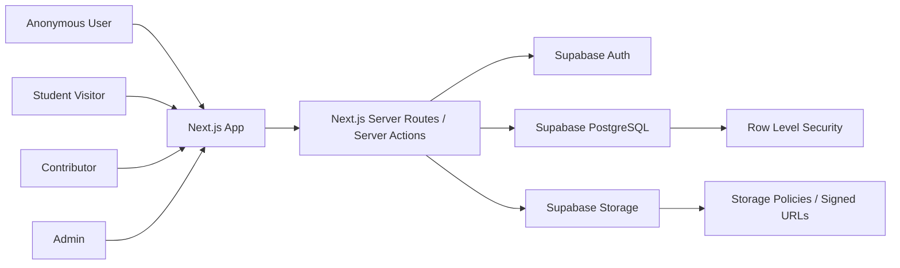

# Alexandria Project Specification

Generated: 2026-06-24

Source documents:

- `docs/Alexandria PRD.md`
- `docs/database-engineer-reference.md`
- `docs/design-decision-log.md`
- `docs/Group 3 _ Project Proposal.md`

Latest implementation sources:

- `docs/api-contracts.md`
- `docs/updated_db_fields.sql`

## 0. Current Implementation Override

As of 2026-06-26, the API contracts and Supabase SQL snapshot contain newer implementation decisions than the earlier planning docs. When there is a conflict, treat these latest files as the implementation source of truth:

- The MVP uses the Supabase JS client through a frontend service layer in `Alexandria/lib/services/`; UI components should not call `supabase.from(...)` directly.
- System roles are now `admin`, `moderator`, and `member`.
- USC identity is stored separately as `affiliation`: `student`, `alumni`, or `professor`.
- User profile data lives in `public.users`, linked to `auth.users`, rather than the earlier `profiles` naming.
- Thesis lifecycle uses `review_status`: `for_review`, `flagged`, and `accepted`; public discovery shows accepted records.
- Any authenticated `member` can submit a thesis for review.
- Only `admin` and `moderator` can approve/accept, flag, or trash submissions.
- Members can edit their own submission only after it has been flagged.
- Members can attach/register their own thesis PDF or file URL.
- Trashed submissions are not recoverable through the admin UI for MVP.
- `moderator` replaces the older Contributor role in implementation-facing work.
- `member` replaces the narrower Student visitor role in implementation-facing work.
- Use `accepted` internally if preserving the current SQL is preferred, but the UI may label that state as Approved.
- Add a `trashed` workflow state or soft-delete path for invalid, duplicate, spam, or intentionally removed submissions. Do not overload `flagged` for this.
- PDF files are uploaded to the public Supabase Storage
  `thesis_files_bucket`. `thesis_files.file_url` remains internal to the
  data/service layer; thesis DTOs expose `file_access.download_path`.
- `recommendations` and `lessons_learned` currently live as text fields on `theses`, not separate ordered tables.
- Authors and advisers live in `thesis_authors`, with required display names, optional `user_id`, and `contribution_role` values `author` or `adviser`.
- Related theses are currently planned as frontend-computed results from overlapping tags.

Legacy sections below may still use earlier terms such as Contributor, Student visitor, profiles, draft/published/archived, or Supabase Storage. For implementation, prefer the override above and the latest `docs/api-contracts.md`, `docs/updated_db_fields.sql`, and `docs/backend-readiness-plan.md`.

## 1. Project Summary

Alexandria is a web-based thesis repository for the Department of Computer Information Science and Mathematics (DCISM). It helps students discover previous thesis work, inspect thesis metadata, learn from recommendations and lessons learned, and publicly access accepted thesis PDFs.

The MVP is not a generic file dump. Its differentiator is structured thesis discovery plus knowledge transfer:

- Recommendations describe study gaps, limitations, research opportunities, and future work.
- Lessons learned describe practical execution guidance, development pitfalls, process advice, tooling issues, team workflow advice, and defense preparation.

## 2. MVP Goal

A student should be able to locate a relevant thesis within 30 seconds and understand whether it is useful to their research within 3 minutes.

The MVP is successful when:

- Published thesis metadata is publicly discoverable.
- PDF preview and download are protected behind authentication.
- Admins and Contributors can maintain thesis records through a draft-to-publish workflow.
- Search, filters, sorting, and related-thesis discovery help students find relevant work.
- The data model supports future expansion without major rewrites.

## 3. Team Roles and Ownership

| Role | Owner Type | Primary Responsibilities |
| --- | --- | --- |
| Backend / Project Manager | User | Owns implementation coordination, API/data contracts, Supabase integration patterns, backend route/action logic, validation gates, merge decisions, and docs consistency |
| Database Engineer | Teammate | Owns ERD, Supabase schema migrations, RLS policies, storage bucket policies, seed data, indexes, and query support |
| Frontend Designer 1 | Teammate | Owns public repository browsing, search/filter/sort UI, thesis cards, thesis detail page, and responsive public layout |
| Frontend Designer 2 | Teammate | Owns auth screens, admin dashboard, upload/edit/publish workflow, PDF preview/download states, and admin usability |

## 4. Accepted Product Decisions

| Area | Decision |
| --- | --- |
| Database | Supabase/PostgreSQL |
| Authentication | Supabase Auth |
| Storage | Public Supabase Storage `thesis_files_bucket`; PDF only, maximum 10 MiB |
| PDF access | Public preview and download for accepted theses |
| Public access | Full accepted metadata and PDFs are public |
| Account creation | Student visitors may self-register with `usc.edu.ph` email addresses |
| Admin/Contributor accounts | Controlled by admins |
| Roles | `admin`, `contributor`, `student_visitor` |
| Thesis statuses | `draft`, `published`, `archived` |
| Admin workflow | Draft, edit/upload/validate, publish |
| Removal workflow | Archive/unpublish in UI; internal soft delete support |
| PDF replacement | Keep old file metadata; mark newest valid file as primary |
| Authors | Ordered author names only; no reusable author profile in MVP |
| Recommendations/lessons | Multiple ordered entries, both required before publish |
| Related theses | Dynamic from shared tags and/or research area |
| Search | Keyword search plus filters plus sort |
| Default sort | Newest thesis year first |
| Classification | Controlled research areas plus flexible tags |

## 5. Implementation Assumptions

These assumptions are made to keep the MVP coherent with the current repository.

- The existing `Alexandria/` Next.js app is the main application surface.
- The backend integration layer should start inside the Next.js app through server-side route handlers/actions and Supabase server clients.
- A separate backend service is not required for MVP unless a later implementation constraint proves otherwise.
- The root `backend/` folder is reserved for future service extraction or backend-only utilities, not required for Phase 1.
- Supabase SSR should be used for server-side auth/session handling in Next.js.
- Supabase clients must be created per request on the server and must not share authenticated server clients across requests.
- Middleware should handle session cookie refresh/persistence.
- Supabase service role keys must never be exposed to browser code.

## 6. Open Inputs Before Implementation

These are the remaining known gaps that should be resolved during implementation planning:

| Input Needed | Why It Matters | Blocking Phase |
| --- | --- | --- |
| Supabase project URL and anon key | Needed to connect app to Supabase | Supabase foundation/Auth phase |
| Supabase service role key handling | Needed for privileged server-only operations, if used | Admin/storage phase |
| Deployment target | Needed for environment variables, preview URLs, and production build settings | Deployment/polish phase |

## 7. Tech Stack

### Current Repository Baseline

- Frontend: Next.js `16.2.9`
- React: `19.2.4`
- TypeScript: `^5`
- Styling: Tailwind CSS `^4`
- Linting: ESLint `^9`, `eslint-config-next` `16.2.9`

### Planned Additions

- `@supabase/supabase-js`
- `@supabase/ssr`
- Optional form validation library if selected during implementation, such as Zod
- Optional UI component utilities only if frontend team agrees and they fit the current design direction

## 8. Architecture

### 8.1 High-Level Architecture

### 8.2 Application Layers

| Layer | Responsibility |
| --- | --- |
| UI layer | Public repository, thesis detail, auth screens, admin dashboard, upload/edit/publish screens |
| Server integration layer | Request validation, auth checks, Supabase client creation, data shaping, PDF signed URL generation |
| Supabase database | Canonical thesis metadata, roles, statuses, tags, research areas, authors, file metadata, recommendations, lessons |
| Supabase storage | Thesis PDF objects |
| RLS/storage policies | Defense-in-depth authorization at database and storage level |

## 9. Data Model

### 9.1 Core Tables

| Table | Purpose |
| --- | --- |
| `departments` | Department records; MVP seed includes DCISM |
| `advisers` | Faculty advisers used for metadata and filtering |
| `research_areas` | Controlled category list |
| `tags` | Flexible keywords |
| `theses` | Core thesis record and publication status |
| `thesis_authors` | Ordered authors and advisers per thesis, with display names and optional linked users |
| `thesis_tags` | Many-to-many thesis/tag relationship |
| `thesis_files` | Supabase Storage metadata and PDF replacement history |
| `thesis_links` | Optional external resources/repository links |
| `thesis_awards` | Optional awards/recognition |
| `thesis_conferences` | Optional conference presentations |
| `thesis_recommendations` | Ordered future-study recommendations |
| `thesis_lessons` | Ordered practical lessons learned |
| `profiles` | App role/display metadata linked to `auth.users` |
| `audit_logs` | Optional trace of important admin/content actions |

### 9.2 Required Thesis Publish Fields

A thesis cannot move to `published` unless it has:

- Title
- At least one ordered author name
- Year
- Adviser
- Department
- Research area
- Abstract
- At least one tag
- Primary PDF file metadata pointing to Supabase Storage
- At least one recommendation
- At least one lesson learned

### 9.3 Status Semantics

| Status | Public Visibility | Meaning |
| --- | --- | --- |
| `draft` | Hidden | Record is being prepared or edited |
| `published` | Visible | Record is discoverable and detail metadata is public |
| `archived` | Hidden | Record was retired/unpublished without normal hard delete |

## 10. Access Control Model

| Actor | Capabilities |
| --- | --- |
| Anonymous user | Browse/search/filter/sort accepted metadata; view accepted details and PDFs |
| Student visitor | Anonymous capabilities plus authenticated contribution features available to members |
| Contributor | Create/edit draft thesis content; upload/replace PDFs if allowed; cannot manage roles; publishing permissions may be admin-defined |
| Admin | Manage roles, publish/archive records, maintain controlled vocabularies, manage all thesis records and files |

Authentication uses Supabase Auth. App roles live in `profiles.role`.

Student visitor self-registration must require an email address under the `usc.edu.ph` domain. Admin and Contributor accounts should be admin-controlled.

## 11. Storage and PDF Rules

- Store PDFs in the public `thesis_files_bucket`; accept PDF only up to 10 MiB.
- Store file metadata in `thesis_files`.
- Anonymous users may preview/download current primary PDFs for accepted theses.
- Admins/Contributors can upload/replace PDFs according to role rules.
- Replacing a PDF should keep old file metadata and mark the newest valid file as primary.
- Student-facing PDF version history is out of scope.
- If Supabase Storage becomes impractical, external PDF/repository links are a fallback.

## 12. Search, Filtering, Sorting, and Related Theses

### 12.1 Search

MVP search should cover:

- Thesis title
- Ordered author names
- Tags
- Abstract keywords
- Year

Implementation can start with SQL `ILIKE`/join-based search. PostgreSQL full-text search with `tsvector`/GIN indexes can be added later if search quality or performance is weak.

### 12.2 Filters

MVP filters:

- Research area
- Adviser
- Department
- Year

### 12.3 Sorting

Default sort: newest thesis year first.

Secondary tie-breaker should be deterministic, such as title ascending or `created_at` descending.

### 12.4 Related Theses

Related theses are computed dynamically from:

- Shared tags
- Same research area
- Optional keyword overlap if cheap enough

Exclude the current thesis from results. AI-powered recommendations, semantic search, and manual override tooling are out of scope.

## 13. API and Server Contracts

The MVP should expose stable server contracts for the frontend. Endpoint names may be implemented as Next.js Route Handlers or equivalent server actions, but the functional contracts should remain stable.

### 13.1 Public Repository Contracts

#### `GET /api/theses`

Purpose: Return paginated published thesis cards.

Query parameters:

- `q`: keyword search
- `researchArea`: research area id/slug
- `adviser`: adviser id
- `department`: department id
- `year`: thesis year
- `sort`: sort option; default `year_desc`
- `page`: page number
- `pageSize`: page size

Response data:

- `items`: thesis card summaries
- `page`
- `pageSize`
- `total`
- `filters`: optional filter metadata if useful

#### `GET /api/theses/:slug`

Purpose: Return full public metadata for a published thesis.

Response data:

- Thesis metadata
- Ordered author names
- Adviser, department, research area
- Tags
- Recommendations
- Lessons learned
- Optional awards/conferences/links
- Related thesis cards
- PDF access state for current user

#### `GET /api/theses/:id/file`

Purpose: Stream or redirect to the current primary PDF without exposing
`thesis_files.file_url` in thesis DTOs.

Auth:

- Public for accepted theses.
- Admin/moderator preview of non-accepted theses requires role enforcement.

### 13.2 Auth/Profile Contracts

#### `GET /api/me`

Purpose: Return current user profile and role.

Response:

- User id
- Email
- Role
- Full name

#### Student signup flow

Purpose: Allow Student visitor registration for `usc.edu.ph` email addresses.

Implementation notes:

- Validate the `usc.edu.ph` domain before or during signup.
- Create or upsert `profiles` row with `student_visitor` role after successful auth signup.
- Admin/Contributor roles must not be self-assignable.

### 13.3 Admin/Contributor Contracts

#### `GET /api/admin/theses`

Purpose: Return paginated draft/published/archived thesis records for admin dashboard.

Auth:

- Admin or Contributor.

#### `POST /api/admin/theses`

Purpose: Create draft thesis metadata transactionally.

Default:

- `publication_status = draft`

#### `PATCH /api/admin/theses/:id`

Purpose: Update draft or authorized thesis metadata.

#### `POST /api/admin/theses/:id/files`

Purpose: Upload or register thesis PDF metadata after storage succeeds.

#### `POST /api/admin/theses/:id/files/replace`

Purpose: Replace current PDF, retain old metadata, mark new file primary.

#### `POST /api/admin/theses/:id/publish`

Purpose: Validate required fields and move thesis from `draft` to `published`.

#### `POST /api/admin/theses/:id/archive`

Purpose: Archive/unpublish a thesis and remove it from public results.

#### `DELETE /api/admin/theses/:id`

Purpose: Internal soft delete only. This should not be a normal admin UI action.

## 14. Frontend Requirements

### 14.1 Public Pages

| Page | Purpose |
| --- | --- |
| Repository browse/search page | Shows thesis cards, search input, filters, sorting, pagination/empty states |
| Thesis detail page | Shows complete metadata, recommendations, lessons, related theses, and PDF access state |
| Auth pages | Student login/signup, auth callback/error states |

### 14.2 Admin/Contributor Pages

| Page | Purpose |
| --- | --- |
| Admin dashboard | List records by status, search records, quick edit/publish/archive actions |
| Thesis editor | Create/edit metadata, authors, tags, recommendations, lessons |
| File upload/replacement panel | Upload primary PDF, replace PDF, show current file metadata |
| Controlled vocabulary management | Optional/admin-only management for research areas, advisers, departments, tags if in MVP capacity |

### 14.3 UI States

Every major page should handle:

- Loading
- Empty
- Error
- Unauthorized
- Validation errors
- Success confirmation

PDF controls should be login-aware:

- Anonymous user: prompt to log in
- Student visitor: preview/download current published PDF
- Contributor/Admin: preview/download for authorized records and manage files where allowed

## 15. Backend / Integration Requirements

- Use server-side Supabase clients for authenticated server work.
- Use browser clients only for safe client-side auth/UI interactions.
- Keep service role keys server-only.
- Centralize Supabase client helpers.
- Centralize role checks.
- Centralize thesis publish validation.
- Shape frontend response objects so UI does not need to know raw table joins.
- Add structured errors for validation, unauthorized, forbidden, not found, and storage failures.

## 16. Database and RLS Requirements

The database engineer should provide:

- Initial migration for core tables.
- Seed data for DCISM, advisers, research areas, tags, sample users, and sample theses.
- RLS policies for public published metadata reads.
- RLS policies for role-based draft/published/archived writes.
- Storage policies or signed URL strategy for private PDF access.
- Indexes for public browse, filtering, author search, tag lookup, and admin status views.

Recommended seed counts:

- Departments: 1
- Advisers: 3-5
- Research areas: 5-8
- Tags: 15-25
- Published thesis records: 8-12
- Draft thesis records: 2
- Archived thesis records: 1
- Admin users: 1
- Contributor users: 1
- Student visitor users: 2

## 17. Environment Configuration

Expected frontend/server environment variables:

- `NEXT_PUBLIC_SUPABASE_URL`
- `NEXT_PUBLIC_SUPABASE_ANON_KEY`
- `SUPABASE_SERVICE_ROLE_KEY`, only if needed for server-only privileged operations
- `ALEXANDRIA_ALLOWED_EMAIL_DOMAINS`, set to `usc.edu.ph` for MVP

Do not commit real credentials.

## 18. Testing and Validation Strategy

### 18.1 Static Checks

- `npm.cmd run lint` from `Alexandria/`
- TypeScript build/type checks once implementation exists

### 18.2 Functional Checks

Core flows to test manually and/or with automated tests:

- Anonymous user browses published metadata.
- Anonymous user cannot preview/download PDFs.
- Student visitor signs up with a `usc.edu.ph` email.
- Student visitor previews/downloads published PDF.
- Admin creates draft thesis.
- Contributor edits draft thesis if allowed.
- Publish fails when required fields are missing.
- Publish succeeds when required fields are complete.
- Public repository hides draft/archived records.
- Archive removes record from public search.
- PDF replacement preserves old metadata and switches primary file.

### 18.3 Security Checks

- Service role key never appears in browser bundle or client code.
- RLS blocks anonymous reads of draft/archived records.
- RLS/storage policies block anonymous PDF access.
- Student visitor cannot access admin routes.
- Contributor cannot manage roles.

## 19. MVP Exclusions

The following are explicitly out of scope:

- AI-generated summaries
- AI-powered thesis recommendations
- Research gap analysis automation
- Student discussions/comments
- Semantic search
- University-wide integration
- Public anonymous PDF downloads
- Reusable author profiles/contact management
- Manual related-thesis overrides
- Full student-facing PDF version history
- Hard delete through normal admin UI
- Open public registration without school email restriction

## 20. Implementation Phasing Guidance

The roadmap should break implementation into conversation-sized phases in this order:

1. Project contracts and team workflow
2. Supabase database/storage/auth foundation
3. Authentication and role enforcement
4. Public repository backend contracts
5. Public repository frontend
6. Admin/contributor backend workflows
7. Admin/contributor frontend workflows
8. Integration QA, demo polish, and documentation

Backend/API contracts should be agreed before frontend work depends on live data. Frontend designers may work against typed mock data while backend/database work is underway.

## 21. Team Workflow

- The backend/project manager maintains this spec, roadmap, phase plans, and API contracts.
- The database engineer owns schema/RLS/storage migrations but reviews every change with the backend/project manager.
- Frontend designers own page/UI work but build against agreed response shapes.
- No role should silently change core product decisions; update `docs/design-decision-log.md` when decisions change.
- Every phase should end with a runnable demo state, validation notes, and a commit.

## 22. References and Current Documentation Notes

Current Supabase documentation confirms:

- Supabase SSR server clients should be created per request and use cookie accessors for session handling.
- Middleware should handle auth token refresh/persistence in SSR frameworks.
- Private Supabase Storage buckets require authorization via authenticated downloads or time-limited signed URLs.
- Storage uploads/downloads require explicit RLS/storage policies.

Implementation should consult current Next.js and Supabase docs before writing code, especially because the repo uses modern Next.js and React versions.
