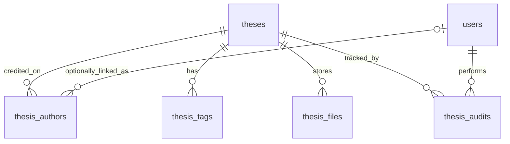

# Alexandria Database Engineer Reference

## Purpose

This reference translates Alexandria's MVP requirements into a database-facing handoff for the database engineer. The accepted MVP backend platform is Supabase: hosted PostgreSQL, Supabase Auth, and Supabase Storage.

Alexandria is a web-based thesis repository for DCISM. The MVP must let students browse, search, filter, preview, and inspect thesis records, while authorized admins manage thesis metadata and document access.

## Team Context

| Role | Responsibility |
| --- | --- |
| Project manager / backend integrator | Defines backend contracts, connects frontend flows to database queries, coordinates API and schema changes |
| Frontend developer 1 | Builds repository browsing, search, filter, and detail UI |
| Frontend developer 2 | Builds admin/upload UI, PDF preview UI, and interaction states |
| Database engineer | Designs schema, migrations, indexes, seed data, and query support for backend |

## Accepted Architecture Decisions

| Decision | Choice | Impact |
| --- | --- | --- |
| Database engine | Supabase/PostgreSQL | Use Postgres tables, foreign keys, migrations, indexes, and Row Level Security policies |
| File storage | Supabase Storage/object storage | Store PDF-only files up to 10 MiB in a storage bucket and save object keys/metadata in `thesis_files` |
| File storage fallback | External PDF/repository links only if storage is blocked | Keep `publication_link` on the `theses` table as fallback path |
| Authentication | Supabase Auth + `users` table | Supabase Auth owns passwords and email verification. A single `users` table (id = Supabase UUID) stores role, affiliation, and display data. A Postgres trigger (`on_auth_user_created`) auto-populates `users` on every signup. If migrating away from Supabase, add `password_hash` via ALTER TABLE and issue force-password-resets |
| Related theses | Frontend computation from overlapping keywords | No `thesis_related` table needed for MVP; frontend derives related theses at render time |
| PDF access | Guest inline preview for accepted theses; active-account download | PDFs remain in a private bucket. `storage_path` stays server-only and a guarded route issues short-lived access |
| Moderator review workflow | Moderators review uploads; review_status tracks state | Records start as `for_review`; moderators set `accepted` or `flagged` |
| Admin workflow | Admins manage users and role access | Admins have a users list and role management view; they do not own the review/publish flow |
| Metadata entry | Upload PDF and manually enter metadata | Upload flow should attach a PDF and require manual metadata entry before a record can be accepted |
| Author and adviser handling | Unified in `thesis_authors` | Authors and advisers are both rows in `thesis_authors` with `contribution_role = 'author'` or `'adviser'`. `user_id` is nullable; unregistered people are credited by `display_name` only. `display_name` is always stored at submission time for stable rendering. |
| Recommendations and lessons | Free-form text fields | Store `recommendations` and `lessons_learned` as text columns directly on the `theses` table |
| Account creation | School-email self-registration | Accounts may self-register with `usc.edu.ph` email addresses; role defaults to `member` |
| Metadata visibility | Full accepted metadata is public | Anonymous users can inspect metadata and inline-preview the complete accepted PDF |
| Delete behavior | Trash invalid submissions | `review_status = 'trashed'` hides records from normal UI; trashed records are not recoverable through the admin UI for MVP |
| User role | `admin`, `moderator`, `member` | Stored in `users.role`; controls system access level. `member` = registered user with upload access and PDF access |
| User affiliation | `student`, `alumni`, `professor` | Stored in `users.affiliation`; describes USC identity type, distinct from system role |
| Review status | `for_review`, `flagged`, `accepted`, `trashed` | Replaces `publication_status`; controls public visibility and moderator workflow |
| PDF replacement | Retain old file metadata | Mark the current file as primary and keep old storage-path metadata for history |
| Search behavior | Search plus filters plus sort | Repository queries should support all three discovery modes |
| Default sort | Newest thesis year first | Use year-descending ordering by default |
| Classification | Free-text research area plus free hashtag-style tags | `research_area` is a text field on `theses`; distinct values are derived at query time for filter dropdowns. Tags are member-assigned narrow keywords |

## MVP Data Requirements

Each thesis record must support:

| Field | Required | Notes |
| --- | --- | --- |
| Title | Yes | Main searchable title |
| Authors | Yes | Multiple authors per thesis; stored via `thesis_authors` with `contribution_role = 'author'`. `display_name` is required; `user_id` is optional |
| Adviser | Yes | Stored in `thesis_authors` with `contribution_role = 'adviser'`. `user_id` is optional; advisers without accounts are credited by name only |
| Year | Yes | Used for display and filtering |
| Department | Yes | Controlled MVP values are `CS`, `IT`, and `IS` for DCISM records. |
| Abstract | Yes | Full detail page text; preview derived by backend/frontend |
| Keywords / tags | Yes | Free hashtag-style; used for search, filtering, and related thesis matching |
| Research area | No | Free text on `theses.research_area`; used for search and filter dropdowns derived from distinct values |
| PDF file or repository link | Yes | Store one or both depending on policy |
| Publication date | No | Optional; displayed on detail page |
| Publication link | No | Optional external publication or repository link |
| Conference | No | Optional conference presentation info (stored as text on theses) |
| Recommendations for future researchers | Yes | Knowledge-transfer feature |
| Lessons learned | Yes | Knowledge-transfer feature |
| Related theses | Yes | Derived on the frontend from overlapping keywords; no DB table required |

Recommendations and lessons are distinct:

- Recommendations describe study gaps, research opportunities, limitations, and future work for later researchers.
- Lessons learned describe practical execution guidance, development challenges, process advice, tooling issues, team workflow advice, defense preparation, and implementation pitfalls.

## Suggested Conceptual Model



## Recommended Tables

### `research_areas`

Not a separate table. No DB enum. `research_area` is stored as free text on `theses`.

**Pattern:** The frontend restricts input to a predefined controlled dropdown list. The DB stays flexible so new research areas can be added without a schema migration. Filter dropdowns are populated via `SELECT DISTINCT research_area FROM theses WHERE review_status = 'accepted'`.

**Data integrity contract:** Any direct DB inserts (seed scripts, admin tooling) must use values from the agreed frontend list to avoid filter fragmentation. The seed script should document the canonical list.

> If the team later decides the list is stable enough, a Postgres `CHECK` constraint or a lookup table can be added as a future migration without breaking existing data.

### `users`

Single table for all authenticated users. `id` is a UUID matching `auth.users.id` from Supabase. A Postgres trigger (`on_auth_user_created`) inserts the `users` row automatically on every Supabase Auth signup.

| Column | Notes |
| --- | --- |
| id | Primary key; UUID matching `auth.users.id` |
| email | Unique; must be `usc.edu.ph` for self-registered users |
| profile_name | Required display name |
| usc_id | Nullable USC ID. Students provide it during registration; other member affiliations may not have one |
| role | System access level. CHECK: `admin`, `moderator`, `member`. Default `member` |
| affiliation | USC identity type. CHECK: `student`, `alumni`, `professor` |
| created_at | Standard timestamp |
| deactivated_at | Nullable timestamp; `NULL` means the account is active |
| deactivation_reason | Nullable administrator-provided current-state reason |
| deactivated_by_user_id | Nullable FK to the administrator who deactivated the account |

> **Portability note:** If migrating away from Supabase Auth, add `password_hash text` via `ALTER TABLE` and issue force-password-resets. UUID `id` values can be preserved in most auth systems that accept custom UUIDs.

> **Role semantics:** `member` means a registered user with upload access and PDF access — not necessarily someone who has submitted a thesis. The name reflects permission level, not activity.

> **USC ID migration:** The reviewed migration makes `users.usc_id` nullable,
> converts the old `0` sentinel to `NULL`, and updates the signup trigger.
> `registerMember()` supplies profile metadata, while `on_auth_user_created`
> remains the only owner of the `public.users` insert.

> **Account lifecycle:** Deactivation preserves both `auth.users` and
> `public.users`. Admin mutations use guarded `SECURITY DEFINER` functions;
> authenticated browser clients are not granted broad table-update rights.

```sql
ALTER TABLE public.users
ALTER COLUMN usc_id DROP NOT NULL;
```

### `theses`

Core thesis record.

| Column | Notes |
| --- | --- |
| id | Primary key |
| title | Required; searchable |
| abstract | Required |
| year | Required; derived from `publication_date`, stored separately, and indexed for filtering |
| department | Stored as text for MVP; normalize to FK in future |
| research_area | Optional free text; used for search and filter dropdowns via `DISTINCT research_area` |
| recommendations | Optional free-form text; uploaders paste or type this section directly from their thesis |
| lessons_learned | Optional free-form text; uploaders paste or type this section directly from their thesis |
| publication_link | Optional external publication or repository link |
| publication_date | Required by the submission contract; actual publication/conference date and cannot exceed today using the `Asia/Manila` date boundary. Audit existing rows before changing the live nullable column to `NOT NULL` |
| conference | Optional conference presentation name |
| review_status | Required: `for_review`, `flagged`, `accepted`, or `trashed`. CHECK constraint enforced. Default `for_review` |
| study_type | Required: `thesis` or `capstone`. CHECK constraint enforced. |
| created_at, updated_at | Standard timestamps |

### `thesis_authors`

Credits people on a thesis. Keeps the `thesis_authors` table name, but now supports both registered users and unregistered people (historical records, external advisers).

| Column | Notes |
| --- | --- |
| id | Primary key; auto-generated |
| thesis_id | Foreign key to `theses`; NOT NULL; CASCADE deletes |
| user_id | Foreign key to `users`; **nullable** — unregistered people have no account; SET NULL on user delete |
| display_name | Required display name; NOT NULL — always stored here for stable rendering |
| contribution_role | CHECK: `author` or `adviser` |
| sort_order | Optional display order integer |

> **Why `display_name` is stored here, not derived from `users.profile_name`:** If a user later changes their profile name or their account is deleted, the thesis credit should remain accurate and stable. The name stored at submission time is the canonical credit.

> **Query pattern for authors:** `SELECT * FROM thesis_authors WHERE thesis_id = $1 AND contribution_role = 'author' ORDER BY sort_order`
> **Query pattern for advisers:** `SELECT * FROM thesis_authors WHERE thesis_id = $1 AND contribution_role = 'adviser' ORDER BY sort_order`

### `thesis_tags`

Stores free hashtag-style tags directly on each thesis. Tags are member-assigned and can be as narrow as needed.

| Column | Notes |
| --- | --- |
| id | Primary key |
| thesis_id | Foreign key to `theses`; NOT NULL |
| tag | Required tag text; NOT NULL |

### `thesis_files`

Stores the private Supabase Storage object path for the PDF.

| Column | Notes |
| --- | --- |
| id | Primary key |
| thesis_id | Foreign key to `theses` |
| file_url | Nullable transitional legacy URL retained for rollback |
| storage_path | Required private object key; never returned in thesis DTOs |
| file_type | Required; MIME type of the file; NOT NULL DEFAULT 'application/pdf' |
| is_primary | Marks the current active PDF; old file rows are retained for history |

> **Retrieval pattern:** The frontend receives
> `file_access.preview_path` and `file_access.download_path`, both mediated by
> `GET /api/theses/:id/file`. The route authorizes access and redirects to a
> short-lived signed URL without exposing `storage_path`.

### `thesis_audits`

Tracks changes to thesis records for admin and moderator traceability.

| Column | Notes |
| --- | --- |
| id | Primary key |
| thesis_id | Foreign key to `theses` |
| changed_by_user_id | Foreign key to `users.id`; nullable for system-level events |
| change_description | Required; Human-readable description of the change; NOT NULL |
| updated_at | Timestamp of the change |

> **`action` removed:** The `action` enum column was dropped. All audit context is captured in `change_description` as free text, which is simpler to maintain and avoids enum drift as the workflow evolves.


### `thesis_related`

Not required for the MVP. Related theses are derived on the frontend from overlapping keywords. This table can be added in a future version if server-side precomputation or manual overrides become necessary.

## Query Patterns To Support

The backend will likely need these database queries:

| Backend need | Query support |
| --- | --- |
| Repository page | List accepted theses with title, ordered author names, year, abstract preview, tags |
| Search | Match title, author names, tags, abstract keywords |
| Filters | Filter by year, department, research area |
| Detail page | Fetch thesis metadata, authors, tags, files, links, recommendations, lessons |
| Moderator review list | Paginated thesis list filtered by `review_status` |
| Admin editor | Create/update thesis and nested authors, tags, files |
| Admin user list | Paginated list of `users` with role and affiliation |
| Related theses | Frontend matches overlapping tags from current thesis against other accepted records |
| Default repository browse | Return accepted theses ordered by newest thesis year first |

## Supabase Access Model

Use Supabase Row Level Security for database authorization.

| Data area | Public/anonymous users | Authenticated users by role |
| --- | --- | --- |
| Accepted theses | Read full accepted metadata | `moderator` reads all statuses; `admin` reads all records |
| `for_review` / `flagged` theses | No access | `moderator` and `admin` read/write |
| Thesis metadata tables | Read records connected to accepted theses | `moderator` creates/updates; `admin` full access |
| `users` | No public browsing | Active users read their own row; active admins read all rows and use guarded RPCs for role/status changes |
| Storage objects | No direct anonymous object access; accepted PDFs use the guarded preview route | Active users upload/delete only within their own folder; guarded server routes issue short-lived preview/download access |
| `thesis_audits` | No access | Insert automatically; `admin` and `moderator` can read |

Recommended policy direction:

- Enable RLS on all public application tables.
- Keep Supabase `auth.users` as the identity source.
- Store system role in `users.role`: `admin`, `moderator`, `member`.
- Store USC identity in `users.affiliation`: `student`, `alumni`, `professor`.
- Restrict self-registration to `usc.edu.ph` email addresses.
- PDF access via the guarded route only; never expose `storage_path` or the service-role key.
- Publicly visible theses = `review_status = 'accepted'` only.

## Suggested Indexes

Exact syntax should target PostgreSQL/Supabase.

| Table | Columns | Purpose |
| --- | --- | --- |
| theses | title | Search by title |
| theses | year | Year filtering |
| theses | department | Department filtering |
| theses | research_area | Research area text search and filter dropdown |
| theses | review_status | Accepted/moderation list filtering |
| theses | year, review_status | Default public browse by newest accepted thesis year |
| thesis_authors | thesis_id | Joins for people lookup per thesis |
| thesis_authors | user_id | Joins to users (nullable, sparse index) |
| thesis_tags | thesis_id | Joins for tag lookup per thesis |
| thesis_tags | tag | Tag text search |
| thesis_files | thesis_id, is_primary | Main PDF lookup |

Consider PostgreSQL full-text search across `theses.title`, `theses.abstract`, `thesis_authors.display_name`, and `thesis_tags.tag`. For the MVP, a simpler `ILIKE` search may be acceptable first, then upgrade to `tsvector`/GIN indexes if search feels slow or weak.

## Backend Contract Notes

Use these as the early API/database boundary:

| API intent | Database responsibility |
| --- | --- |
| `GET /api/theses` | Future route for paginated accepted thesis cards with filters and search |
| `GET /api/theses/:id` | Future route for a full accepted-thesis detail payload |
| `submitThesis(FormData)` | Current server action: authenticate, upload the PDF, and create a `for_review` thesis plus related metadata transactionally |
| `PATCH /api/theses/:id` | Future route to update thesis plus nested metadata safely |
| `POST /api/theses/:id/files` | Future route to attach a file to an existing thesis |
| `POST /api/theses/:id/files/replace` | Future route to retain old metadata and replace the primary PDF |
| `POST /api/moderator/theses/:id/accept` | Validate required metadata/file presence, then set `review_status = 'accepted'` |
| `POST /api/moderator/theses/:id/flag` | Set `review_status = 'flagged'` and optionally record a reason in `thesis_audits` |
| `POST /api/admin/theses/:id/trash` | Move a record to trashed state and remove it from public and active review results |
| `getAdminDashboardSnapshot()` | Current guarded aggregate RPC/service for metrics, uploads, audits, and departments |
| `GET /api/admin/users` | Future HTTP equivalent of the current paginated user service |
| `PATCH /api/admin/users/:id/role` | Future HTTP equivalent of the guarded role-transition function |
| `deactivateUser()` / `reactivateUser()` | Current reversible account-status services |

## Seed Data Needed

Minimum seed data for frontend/backend integration:

| Data | Minimum count |
| --- | --- |
| Department values | 3: `CS`, `IT`, and `IS` (as text on theses) |
| Research areas | 5 to 8 (broader curated domains) |
| Accepted thesis records | 8 to 12 |
| For-review thesis records | 2 |
| Flagged thesis records | 1 |
| Admin user record | 1 (role = admin, affiliation = professor) |
| Moderator user record | 1 (role = moderator, affiliation = professor) |
| Member user records | 2 (role = member, affiliation = student) |
| Author + adviser users linked to seeded theses | As needed |

## Resolved Decisions

1. Database engine:
   - Accepted: Supabase/PostgreSQL.

2. File storage:
   - Accepted: Supabase Storage/object storage, with links-only as fallback if storage becomes impractical.

3. Authentication and user table:
   - Accepted: Supabase Auth handles passwords and email verification. A single `users` table (id = Supabase UUID) stores `role`, `affiliation`, and display data. A Postgres trigger auto-populates `users` on signup. If migrating away from Supabase, add `password_hash` via ALTER TABLE and issue force-password-resets.

4. Related thesis logic:
   - Accepted: Computed on the frontend from overlapping keywords/tags. No `thesis_related` table for MVP.

5. Account creation:
   - Accepted: Users may self-register with `usc.edu.ph` email addresses. `role` defaults to `member`.

6. Metadata visibility:
   - Accepted: Full accepted thesis metadata is public. Guests may inline-preview complete accepted PDFs through the guarded server route; explicit download requires an active account.

7. Delete behavior:
   - Accepted: Invalid or removed submissions use `review_status = 'trashed'`. Trashed records are hidden from normal UI and are not recoverable through the admin UI for MVP.

8. User role:
   - Accepted: `admin`, `moderator`, `member`. Stored in `users.role`.

9. User affiliation:
   - Accepted: `student`, `alumni`, `professor`. Stored in `users.affiliation`. Distinct from system role.

10. Review status:
    - Accepted: `for_review`, `flagged`, `accepted`, `trashed`. Replaces `publication_status`. CHECK constraint required.

11. Search and classification:
    - Accepted: Search plus filters plus sort, newest thesis year first by default. `research_area` is free text on `theses`; tags are contributor-assigned hashtags.

## Resolved Feature Decisions

These choices affect schema, storage policy, and backend API behavior.

1. PDF access policy:
   - Accepted: Guests may inline-preview complete accepted PDFs. Explicit download requires an active account; submitters and reviewers receive the additional review-state access frozen in the backend contract.

2. Review and acceptance workflow:
   - Accepted: Uploaded records start as `for_review`; moderators set `accepted` or `flagged`.

3. Metadata source of truth:
   - Accepted: Uploader attaches PDF and manually enters required metadata.

4. Author and adviser handling:
   - Accepted: Both stored as rows in `thesis_authors` with `contribution_role = 'author'` or `'adviser'`. `user_id` is nullable; unregistered people are credited by `display_name` only.

5. Research area:
   - Accepted: Free text on `theses.research_area`. Filter dropdown is populated via `SELECT DISTINCT research_area FROM theses WHERE review_status = 'accepted'`.

6. PDF file storage:
   - Accepted: PDFs stay in a private Supabase Storage bucket. The database
     stores canonical `storage_path`; browser DTOs expose guarded application
     routes rather than provider URLs or raw object paths.

## Recommended First Task For DB Engineer

Create an initial ERD and migration draft for:

- `users`
- `theses`
- `thesis_authors`
- `thesis_tags`
- `thesis_files`
- `thesis_audits`

Then review it with the backend integrator before adding optional conferences and soft-delete behavior.

## Current Schema Polishing Needed

Before frontend integration, confirm these details in Supabase:

- `theses.review_status` includes `for_review`, `flagged`, `accepted`, and `trashed`.
- `thesis_authors` stores both authors and advisers through `contribution_role`.
- Add `theses.submitted_by_user_id uuid REFERENCES public.users(id)` so the backend can enforce member-owned editing and file registration.
- Consider a partial unique index on `thesis_files(thesis_id)` where `is_primary = true` so only one primary PDF exists per thesis.

## Future / Optional Tables

### `departments`

Currently, `department` is stored as a free-text string on the `theses` table to simplify the MVP schema. If the application needs to expand to multiple departments with specific metadata (e.g., department heads, specific rules), a `departments` table can be introduced.

| Column | Notes |
| --- | --- |
| id | Primary key |
| name | Unique department name, e.g. `Department of Computer Information Science and Mathematics` |
| code | Unique short code, e.g. `DCISM` |
| created_at, updated_at | Standard timestamps |
